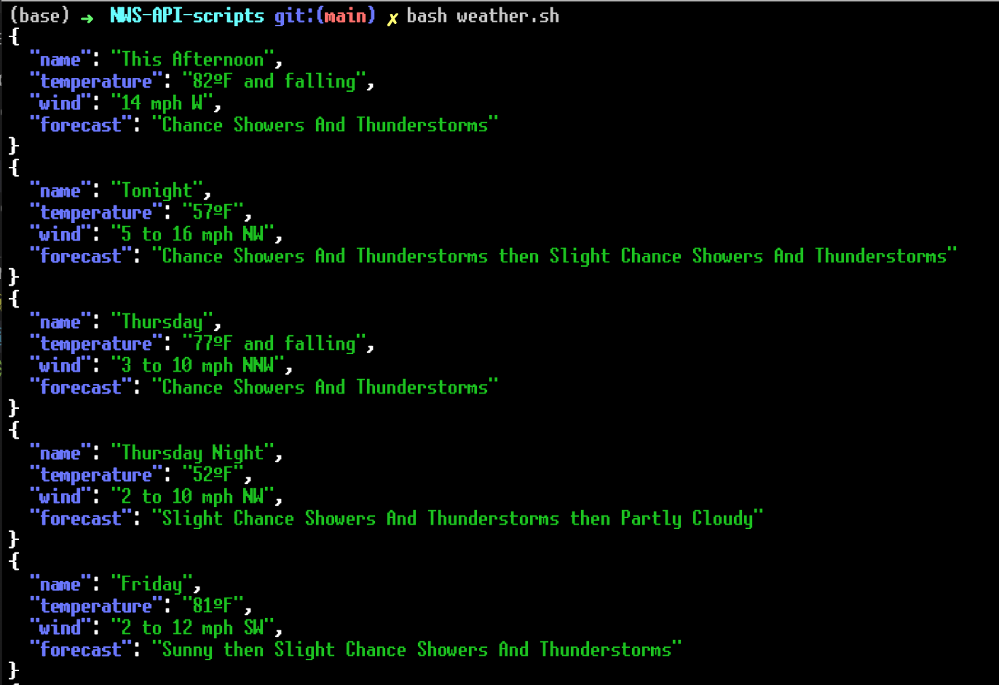

# NWS API script
This repo contains a simple script to query the National Weather Service API and retrieve the forecast for a location. The documentaiton for the API is available here:
> https://www.weather.gov/documentation/services-web-api

This API is 100% free to access, but it will only provide data for locations within the US.

For now this only gets the basic 7-day forecast. I may or may not decide to add more scripts in the future.

### Requirements
Unless I'm wrong, the only additional tool you might need is jq.

Linux:
> sudo apt install jq

Homebrew: 
> brew install jq 

